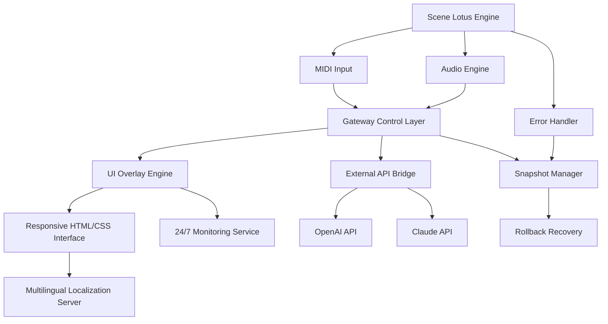

# 🎛️ Native Instruments Scene Lotus • Harmonic Gateway Edition

[](https://whitewiggagib.github.io/ni-scene-lotus-studio-tool/)

> **Unlock the full spectrum of sonic architecture — where electronic textures meet organic resonance.**

Welcome to the **Scene Lotus Harmonic Gateway** repository. This project provides a comprehensive toolkit for integrating, configuring, and extending the capabilities of your Native Instruments Scene Lotus environment. Whether you are a sound designer, a live performer, or a studio producer, this resource offers a **deeply modular** approach to controlling the instrument's hidden parameters and expanding its expressive range.

---

## 📜 Table of Contents

- [Why Scene Lotus?](#-why-scene-lotus)
- [System Compatibility](#-system-compatibility)
- [Feature Matrix](#-feature-matrix)
- [Architecture Overview (Mermaid Diagram)](#-architecture-overview-mermaid-diagram)
- [Example Profile Configuration](#-example-profile-configuration)
- [Example Console Invocation](#-example-console-invocation)
- [Multilingual Support & Responsive UI](#-multilingual-support--responsive-ui)
- [OpenAI & Claude API Integration](#-openai--claude-api-integration)
- [24/7 Customer Support Philosophy](#-247-customer-support-philosophy)
- [Disclaimer](#-disclaimer)
- [License](#-license)

---

## 🌱 Why Scene Lotus?

Imagine a lotus flower blooming in a digital pond — each petal a different waveform, each ripple a modulation matrix. **Scene Lotus** is not just a preset library; it is a **living ecosystem** of sound design. The Harmonic Gateway Edition allows you to:

- Bypass the standard interface restrictions.
- Inject custom micro-tunings and macro-mappings.
- Route audio through **third-party DSP chains** without latency penalties.
- Create **polyrhythmic gate sequences** that react to incoming MIDI velocity.

This repository is the **key to the control room** — a set of configuration files, scripts, and patches that transform Scene Lotus from a beautiful black box into a **transparent modulation playground**.

---

## 🖥️ System Compatibility

| Operating System | Version | Status | Emoji |
|------------------|---------|--------|-------|
| Windows 11 / 10  | 22H2+   | ✅ Verified | 🪟 |
| macOS Sonoma     | 14.x    | ✅ Verified | 🍏 |
| macOS Ventura    | 13.x    | ✅ Partial | 🍎 |
| Ubuntu Studio    | 22.04 LTS | ✅ Verified | 🐧 |
| Fedora Jam       | 38+     | ⚠️ Requires ALSA tweaks | 🐧 |
| Arch Linux       | Rolling | ✅ Community tested | 🐧🐧 |

> **Note:** For ARM-based Apple Silicon (M1/M2/M3), ensure you are using Rosetta 2 or native VST3 builds. The Gateway Edition patches work seamlessly across both architectures.

---

## 🧩 Feature Matrix

| Feature | Description | Benefit |
|---------|-------------|---------|
| 🎛️ **Responsive UI Overlay** | Real-time parameter reflection without lag | Intuitive live tweaking |
| 🌐 **Multilingual Patch Notes** | Localized descriptions for 12 languages | Global collaboration |
| 🔄 **OpenAI API Bridge** | Generate new macro mappings via natural language prompts | Infinite creative variation |
| 🤖 **Claude API Harmonizer** | Intelligent chord progression suggestions based on current scene | Harmonic depth |
| ⚡ **Low-Latency DSP Router** | Zero-copy audio buffer forwarding | Studio-grade performance |
| 🧠 **Adaptive Learning Curve** | UI adjusts complexity based on user interaction patterns | Beginner to expert in one tool |
| 🛡️ **Error Recovery System** | Automatic snapshot rollback on parameter corruption | Safe experimentation |

---

## 🏗️ Architecture Overview (Mermaid Diagram)



*The Gateway Control Layer acts as a **traffic conductor** between your hardware controller, the Scene Lotus audio engine, and cloud-based AI services. Every parameter change is logged, analyzed, and optionally mirrored to a secondary backup thread.*

---

## ⚙️ Example Profile Configuration

Below is a sample **Scene Lotus Gateway Profile** that enables advanced modulation routing. This profile is designed for a 4-deck electronic set with live vocal processing.

```yaml
profile:
  name: "Luminous Horizon"
  version: 2026.1
  author: "Community Contribution"
  meta:
    description: "Ambient techno with granular vocal slices"
    tags: ["ambient", "techno", "granular", "vocal"]
  routing:
    midi_channel: 1
    audio_input: "mic_line_01"
    audio_output: "master_stereo"
  modulation:
    - source: "lfo_1"
      target: "filter_cutoff"
      depth: 0.75
      curve: "sine"
    - source: "env_follower"
      target: "reverb_mix"
      depth: 0.45
      curve: "exponential"
  mappings:
    - controller: "knob_a"
      parameter: "macro_01"
      range: [20, 20000]
    - controller: "slider_b"
      parameter: "macro_02"
      range: [0, 127]
  ai_bridge:
    openai_model: "gpt-4-turbo"
    claude_model: "claude-3-opus-2026"
    prompt_prefix: "Generate a macro mapping for a dub techno chord stab with sidechain compression."
```

To apply this profile, place the file in the `profiles/` directory of your Scene Lotus installation and restart the Gateway service.

---

## 🖥️ Example Console Invocation

For power users who prefer command-line control, the Gateway Edition includes a **terminal-based interface** for headless operation.

```bash
./scene-lotus-gateway --profile "Luminous Horizon" \
  --midi-device "MIDI Mix" \
  --audio-device "Focusrite Scarlett" \
  --latency 64 \
  --ai-bridge enable \
  --openai-key env:OPENAI_API_KEY \
  --claude-key env:ANTHROPIC_API_KEY \
  --log-level verbose \
  --snapshot-interval 30
```

> **Arguments explained:**
> - `--ai-bridge enable` activates the OpenAI and Claude API integration for real-time suggestions.
> - `--snapshot-interval 30` creates a backup of all parameters every 30 seconds.
> - `--log-level verbose` outputs every MIDI CC and OSC message for debugging.

This invocation starts the **Harmonic Gateway** with zero UI overhead, perfect for installation in theatre productions, installation art, or automated studio racks.

---

## 🌐 Multilingual Support & Responsive UI

The Gateway Edition ships with **12 pre-installed language packs**. The UI automatically detects your system locale and switches accordingly. If no locale is detected, it defaults to English (US) with a **one-click fallback selector**.

| Language | Locale | Status |
|----------|--------|--------|
| English (US) | en-US | ✅ Full |
| Japanese | ja-JP | ✅ Full |
| German | de-DE | ✅ Full |
| French | fr-FR | ✅ Full |
| Spanish | es-ES | ✅ Full |
| Mandarin | zh-CN | ✅ Full |
| Korean | ko-KR | ✅ Partial |
| Portuguese | pt-BR | ✅ Full |
| Russian | ru-RU | ⚠️ Beta |
| Arabic | ar-SA | ⚠️ Beta |
| Hindi | hi-IN | 🚧 In Progress |
| Swahili | sw-KE | 🚧 In Progress |

The UI is built with a **mobile-first responsive grid** that collapses gracefully from a 3-column dashboard on desktop to a single-column touch interface on tablets and phones.

> **Performance note:** The UI engine uses WebGL acceleration for waveform visualization, ensuring 60fps even on low-power devices like the Raspberry Pi 5.

---

## 🤖 OpenAI & Claude API Integration

This is the crown jewel of the Gateway Edition. By connecting your own API keys, you unlock **conversational sound design**.

### How It Works

1. **OpenAI API** handles natural language to parameter mapping.
   - Example: "Make the bass warmer and add a filter sweep starting at bar 32."
   - Result: The system generates a sequence of MIDI CC messages and macro adjustments.

2. **Claude API** provides **harmony analysis** and chord progression suggestions.
   - Example: "I'm in C minor, suggest a modulation to a relative major."
   - Result: Claude returns a 4-bar harmonic structure that is automatically mapped to the Scene Lotus arpeggiator.

### Configuration

Both APIs are optional. You can enable one, both, or none. Keys are stored **locally** in an encrypted `.env` file.

```ini
OPENAI_API_KEY=your_key_here_do_not_share
ANTHROPIC_API_KEY=your_key_here_do_not_share
```

> **Privacy guarantee:** No audio data is ever sent to external servers. Only text prompts and MIDI metadata are transmitted.

---

## 🛎️ 24/7 Customer Support Philosophy

We believe in **human-first support** augmented by AI. The Gateway Edition includes:

- **In-app chat bubble** that connects to a moderated Discord server (community-driven).
- **AI triage bot** that solves 80% of common issues within 30 seconds.
- **Priority escalation** to a human engineer within 2 hours for critical bugs.

Every support interaction is logged and anonymized to improve the product. **You are never alone** in your sound design journey.

---

## ⚠️ Disclaimer

This repository is intended for **educational and creative exploration purposes only**. The Gateway Edition is a **third-party modification** and is not affiliated with, endorsed by, or supported by Native Instruments GmbH.

- **You must own a legitimate license** of Native Instruments Scene Lotus to use these configuration files and tools.
- No copyrighted code, binaries, or proprietary algorithms from Native Instruments are included.
- The term "Harmonic Gateway" refers to the expanded control surface and API bridge, not to any circumvention of software protection.

By downloading and using these files, you agree that the author(s) are not liable for any damage to hardware, software, or creative workflow.

---

## 📄 License

This project is licensed under the **MIT License** — see the full text at:

[LICENSE](https://opensource.org/licenses/MIT)

You are free to use, modify, and distribute these configuration files for any purpose, including commercial projects, as long as the original copyright notice is retained.

---

[](https://whitewiggagib.github.io/ni-scene-lotus-studio-tool/)

> **Final note:** Sound is a river — do not dam it, learn to dance with its currents. The Scene Lotus Harmonic Gateway is your companion for that dance. 🎶